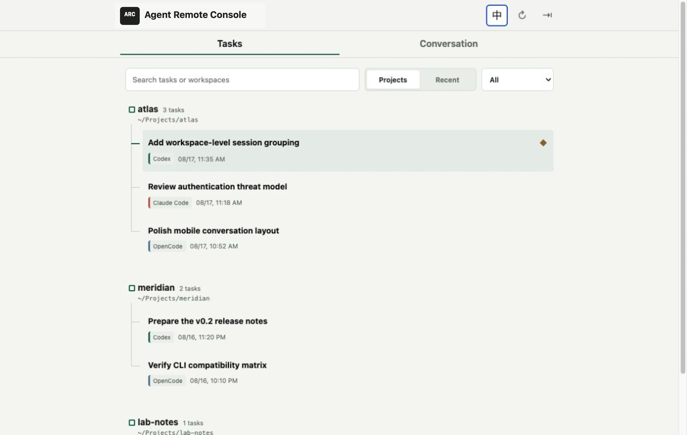

<div align="center">

# Agent Remote Console

**Control Codex, Claude Code, and OpenCode running on your computer, from any browser.**

A self-hosted, mobile-first console that finds your existing coding-agent sessions, groups them by workspace, resumes them in context, and streams progress live. No cloud account or API-key proxy required.

[中文文档](README.zh-CN.md) · [Security](SECURITY.md) · [Contributing](CONTRIBUTING.md) · [Launch Kit](docs/launch-kit.md)

</div>

> [!IMPORTANT]
> Agent Remote Console is an unofficial community project. It is not affiliated with OpenAI, Anthropic, or the OpenCode maintainers. Run it on loopback, Tailscale, or another trusted private network. It is not hardened for direct public-internet exposure.



Agent Remote Console turns the coding-agent CLIs on your computer into remotely controllable workers. The work still runs locally with each CLI's existing login, filesystem, terminal, and tool access.

This complements, rather than replaces, official provider clients. The opportunity is the control-plane layer they do not share: one private interface for existing Codex, Claude Code, and OpenCode sessions, plus an HTTP/SSE bridge that lets another agent or automation service dispatch work to the computer. It does not require moving provider credentials to the cloud or proxying API keys.

## A Remote Control Plane for Local Agents

| Controller | What it can do through Agent Remote Console |
| --- | --- |
| Phone or browser | Find a session, resume it, send instructions, watch tools, queue follow-ups, and stop a run |
| Automation or webhook | Discover available sessions, dispatch a task to a selected workspace, and consume structured events |
| Another AI agent | Use Agent Remote Console as an HTTP tool and delegate coding work to Codex, Claude Code, or OpenCode on the host |

This makes a useful two-level agent system: a third-party API agent can plan or orchestrate remotely, while a coding agent on your computer performs repository work with local tools and returns its progress. Agent Remote Console controls supported coding-agent processes; it does not provide unrestricted desktop control by itself. Filesystem reach and command execution remain limited by the selected workspace and the explicit full-access setting.

## Quick Start

Requirements: macOS or Linux, Node.js 22.5+, and at least one supported CLI on `PATH`. Windows users should follow the WSL2 path below; its end-to-end verification is still pending.

```bash
git clone https://github.com/fadeoreo/agent-remote-console.git
cd agent-remote-console
corepack enable
pnpm install
REMOTE_PASSWORD='choose-a-strong-password' pnpm start
```

Open `http://127.0.0.1:3001`. To use Agent Remote Console from a phone on your trusted private network:

```bash
HOST=100.x.y.z PORT=3001 REMOTE_PASSWORD='choose-a-strong-password' pnpm start
```

Replace `100.x.y.z` with the host's Tailscale or private VPN address. The phone must be connected to the same tailnet or VPN. You can find the host's Tailscale IPv4 address with `tailscale ip -4`. Do not bind Agent Remote Console to a public interface without an external security layer.

## Windows: Use WSL2

WSL2 is the recommended experimental Windows path. Native Windows is currently unsupported and untested. Run Agent Remote Console, the provider CLIs, their authentication, and your repositories inside the same WSL2 distribution. This keeps session discovery, Unix process behavior, file permissions, and CLI paths aligned with the Linux deployment.

From an elevated PowerShell terminal:

```powershell
wsl --install -d Ubuntu
wsl --update
wsl -d Ubuntu
```

Then, from the WSL shell, install Node.js 22.5+ and the coding-agent CLIs you intend to use, authenticate those CLIs inside WSL, and install Agent Remote Console:

```bash
mkdir -p ~/code && cd ~/code
git clone https://github.com/fadeoreo/agent-remote-console.git
cd agent-remote-console
corepack enable
pnpm install
REMOTE_PASSWORD='choose-a-strong-password' pnpm start
```

Verify the service inside WSL with `curl http://127.0.0.1:3001/api/health`, then open `http://localhost:3001` from Windows. If that URL does not work, check that WSL localhost forwarding is enabled.

For phone or remote-agent access, the documented path is to run Tailscale inside the same WSL2 distribution and use the Tailscale setup below from the WSL shell. If Tailscale runs only on the Windows host, host-to-WSL forwarding and Windows Firewall configuration are also required; that topology has not been validated by this project.

Keep repositories under the WSL filesystem, such as `~/code/project`, rather than `/mnt/c/...`. This avoids slower I/O and common permission, symlink, and file-watcher problems. Install and authenticate Codex, Claude Code, and OpenCode inside WSL as well; do not mix Windows-native session data with a WSL-hosted console.

Codex itself supports both native Windows and WSL2, but Agent Remote Console does not currently support native Windows. Native support needs dedicated implementation and testing for `.cmd` executable discovery, provider data locations, process termination, and Windows service installation. WSL1 is not supported by current Codex versions. See the official [Codex WSL guide](https://learn.chatgpt.com/docs/windows/wsl).

## Recommended Setup: Tailscale

[Tailscale](https://tailscale.com/download) is the recommended way to reach Agent Remote Console away from home. It keeps the console off the public internet while allowing your phone, browser, automation, or another trusted agent to connect directly to the host.

```text
Phone / browser / trusted remote agent
                 |
         encrypted tailnet
                 |
Agent Remote Console on the host
                 |
     Codex / Claude Code / OpenCode
```

1. Install Tailscale on the computer running Agent Remote Console and on the phone or remote controller.
2. Sign both devices into the same tailnet and confirm they can see each other.
3. Generate a stable password hash instead of storing a plaintext password in a service definition:

   ```bash
   pnpm password -- 'choose-a-long-unique-password'
   ```

4. Bind Agent Remote Console only to the host's Tailscale address:

   ```bash
   TAILSCALE_IP="$(tailscale ip -4)"
   HOST="$TAILSCALE_IP" PORT=3001 \
     REMOTE_PASSWORD_HASH='paste-the-generated-hash' \
     pnpm start
   ```

5. Open `http://100.x.y.z:3001` on the phone. If MagicDNS is enabled, the machine name can be used instead of the IP address.

### Tailscale Best Practices

- Keep `REMOTE_PASSWORD_HASH` enabled even though access already requires the tailnet. Network identity and application authentication protect different layers.
- Use Tailscale grants or ACLs to limit TCP port `3001` to your own users, devices, or controller tag.
- Do not enable Tailscale Funnel for this service. Funnel makes a service reachable from the public internet, which is outside this project's security model.
- Keep full-access mode off for routine work. Enable it only when a task genuinely needs paths outside the selected workspace.
- Run the service under your normal development account or a dedicated account with access only to the repositories it should control.
- Keep Codex, Claude Code, and OpenCode authentication on the host. Agent Remote Console does not need their API keys.
- For a third-party agent, run its controller inside the same tailnet, use the authenticated HTTP API, retain the login cookie only in memory, and log in again after the console restarts.
- Review missing-workspace warnings before resuming old sessions; a historical session may point to a directory that no longer exists.

## What It Does

- Finds existing Codex, Claude Code, and OpenCode sessions without importing them.
- Groups sessions by workspace or sorts them globally by latest activity.
- Resumes work in the recorded directory and forks when a provider requires it.
- Normalizes messages, reasoning, tools, errors, and completion events over SSE.
- Supports stop controls, queued follow-ups, model selection, and explicit full access.
- Shows only providers that are actually installed on the host.
- Provides a build-free, bilingual UI designed for desktop and mobile browsers.

## HTTP API for Agents and Automation

The web UI uses the same JSON and SSE endpoints available to another trusted service. The following example logs in, selects the most recently active session, starts a local coding-agent run, and follows its event stream. It requires `curl` and `jq`.

```bash
AGENT_REMOTE_URL='http://127.0.0.1:3001'
AGENT_REMOTE_PASSWORD='choose-a-strong-password'
AGENT_REMOTE_COOKIE_JAR="$(mktemp -t agent-remote-console.XXXXXX)"

curl -sS -c "$AGENT_REMOTE_COOKIE_JAR" \
  -H 'Content-Type: application/json' \
  -d "$(jq -n --arg password "$AGENT_REMOTE_PASSWORD" '{password: $password}')" \
  "$AGENT_REMOTE_URL/api/login"

AGENT_REMOTE_SESSIONS="$(curl -sS -b "$AGENT_REMOTE_COOKIE_JAR" "$AGENT_REMOTE_URL/api/sessions?refresh=1")"
AGENT_REMOTE_SESSION_ID="$(jq -r '.sessions[0].id' <<<"$AGENT_REMOTE_SESSIONS")"
AGENT_REMOTE_CWD="$(jq -r '.sessions[0].cwd' <<<"$AGENT_REMOTE_SESSIONS")"

AGENT_REMOTE_RUN_ID="$(curl -sS -b "$AGENT_REMOTE_COOKIE_JAR" \
  -H 'Content-Type: application/json' \
  -d "$(jq -n \
    --arg sessionId "$AGENT_REMOTE_SESSION_ID" \
    --arg cwd "$AGENT_REMOTE_CWD" \
    --arg prompt 'Inspect the failing tests and propose a fix.' \
    '{sessionId: $sessionId, cwd: $cwd, prompt: $prompt, fullAccess: false}')" \
  "$AGENT_REMOTE_URL/api/run" | jq -r '.runId')"

curl -N -b "$AGENT_REMOTE_COOKIE_JAR" \
  "$AGENT_REMOTE_URL/api/events/$AGENT_REMOTE_RUN_ID"
```

Useful endpoints include `GET /api/sessions`, `GET /api/session/:id/history`, `POST /api/run`, `POST /api/message/:runId`, `GET /api/events/:runId`, and `POST /api/stop/:runId`. Authentication currently uses the same in-memory session cookie as the browser. Treat this as a private-network integration API; token authentication and a versioned public contract are not implemented yet.

## Provider Support

| Capability | Codex | Claude Code | OpenCode |
| --- | --- | --- | --- |
| Discover local sessions | Yes | Yes | Yes |
| Read conversation history | Yes | Yes | Yes |
| Resume in the recorded workspace | Yes | Yes | Yes |
| Resume behavior | Reuse or fork when busy | Fork | Fork |
| Stream messages and tools | Yes | Yes | Yes |
| Discover model choices | Built in | Built in | `opencode models` |
| Queue follow-up prompts | Yes | Yes | Yes |
| Steer the active turn | Live | Sequential queue | Sequential queue |

Providers use their existing CLI installation and authentication. An unavailable CLI is omitted from both the API and UI. A model reported by a CLI can still fail if its provider credentials are invalid; Agent Remote Console surfaces that error in the run.

### Verification Status

| Provider | Current verification |
| --- | --- |
| Codex | Real discovery, history, fork, app-server run, and SSE smoke test |
| OpenCode 1.17.18 | Real discovery, model listing, fork, SQLite completion, error, and SSE smoke test |
| Claude Code | Discovery and stream normalization tests; live compatibility matrix pending |

Codex app-server behavior, Claude Code JSONL files, and the OpenCode SQLite schema are upstream implementation surfaces and may change. Compatibility fixes and reports should include the provider CLI version.

## How It Works

```text
Browser UI
   |  authenticated JSON API + Server-Sent Events
Agent Remote Console HTTP server
   |-- authentication, rate limiting, queue, event journal
   |-- unified session and event contracts
   `-- provider integrations
         |-- Codex app-server protocol
         |-- Claude Code stream-json CLI + JSONL history
         `-- OpenCode JSON CLI + SQLite history
```

The frontend receives one session shape and one event shape regardless of provider. Codex keeps a persistent app-server connection for live steering. Claude Code and OpenCode run one non-interactive CLI process per turn, so queued follow-ups are processed sequentially.

## Configuration

| Variable | Default | Purpose |
| --- | --- | --- |
| `HOST` | `127.0.0.1` | Address to bind |
| `PORT` | `3001` | HTTP port |
| `REMOTE_PASSWORD` | generated | Plaintext login password for local development |
| `REMOTE_PASSWORD_HASH` | unset | Scrypt value generated by `pnpm password` |
| `CODEX_BIN` | resolved from `PATH` | Override Codex executable |
| `CLAUDE_BIN` | resolved from `PATH` | Override Claude Code executable |
| `OPENCODE_BIN` | resolved from `PATH` | Override OpenCode executable |
| `CLAUDE_HOME` | `~/.claude` | Claude Code data directory |
| `OPENCODE_DATA_HOME` | `~/.local/share/opencode` | OpenCode data directory |
| `STATE_FILE` | `runtime/state.json` | Pins and workspace overrides |
| `AGENT_REMOTE_CONSOLE_SOURCE` | repository root | Extra workspace root for self-maintenance |

Deprecated aliases `SESSIONMUX_SOURCE` and `REMOTE_LITE_SOURCE` remain accepted so existing installations continue to work.

### Stable Password Hash

Avoid storing a plaintext password in a service definition:

```bash
pnpm password -- 'choose-a-strong-password'
REMOTE_PASSWORD_HASH='salt:hash-from-the-command' pnpm start
```

If neither password variable is set, Agent Remote Console generates a random password on every start and prints it once. There is no built-in default password.

## Deployment Notes

`pnpm deploy` updates an existing macOS LaunchAgent installation and waits for an active turn before restarting. It does not install the LaunchAgent. The deployment directory and service label still use the legacy `codex-remote-lite` name so existing installations continue to upgrade safely.

`pnpm deploy` is not available on Linux, WSL2, or native Windows. For now, Linux and WSL2 users should run `pnpm start` in the foreground or configure their own service manager. Complete install/uninstall commands for macOS, Linux, and WSL2 are planned before the first stable release.

## Security Boundary

- Intended for one trusted user on loopback or a private VPN.
- Session cookies are HTTP-only and `SameSite=Strict`.
- Login attempts are rate-limited and stable password hashes use scrypt.
- Rendered Markdown is sanitized with DOMPurify and protected by CSP.
- Only one agent run is allowed at a time.
- Full-access mode is explicit and visible in the composer.

Read [SECURITY.md](SECURITY.md) before using Agent Remote Console outside the local machine.

## Development

```bash
pnpm check
pnpm test
```

The browser UI intentionally has no build step. Provider behavior belongs in `lib/providers.mjs`; shared HTTP, Codex app-server, queue, and event behavior currently lives in `server.mjs`. Splitting the remaining Codex integration out of the server is an open architecture task, not a completed abstraction.

## Roadmap

- Complete macOS, Linux, and WSL2 service installation and verification.
- Add and verify a native Windows process, path, and service implementation.
- Add a versioned live compatibility matrix for all three CLIs.
- Move Codex-specific app-server behavior behind the provider boundary.
- Add automated responsive screenshots and end-to-end browser tests.

## License

[MIT](LICENSE)
